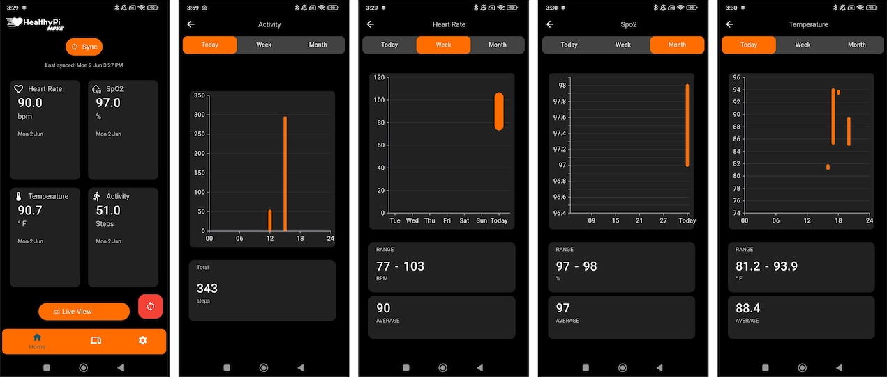

# HealthyPi Move Mobile App

The HealthyPi Move app is designed to work with the HealthyPi Move hardware, which is a wearable device that tracks various health metrics. The app allows users to view and analyze their health data in real-time. 

## Features
- **Real-time Data Monitoring**: View heart rate, SpO2, and other health metrics in real-time.
- **Data Logging**: Log health data for later analysis.
- **User-Friendly Interface**: Easy to navigate and understand health metrics.
- **Data Export**: Export health data for further analysis or sharing.

## Installation

You can install the HealthyPi Move app from the Google Play Store: https://play.google.com/store/apps/details?id=com.protocentral.move

    
    

## Compiling from Source

Please refer to the [Flutter documentation](https://flutter.dev/docs/get-started/install) for instructions on how to set up your development environment and compile the app from source.

## Contributing
We welcome contributions to the HealthyPi Move app! If you have suggestions or improvements, please open an issue or submit a pull request.

## License
This project is licensed under the MIT License. See the [LICENSE](LICENSE) file for details.

## Support
If you have any questions or need support, please open an issue on the GitHub repository.

